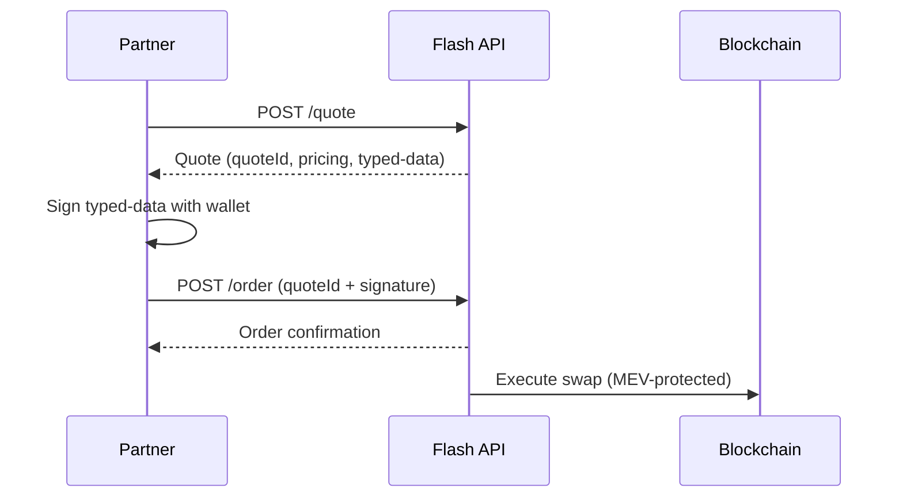

## Key features

- **Instant quotes** — real-time pricing, fee breakdown, and routing for any supported token pair.
- **Wallet signing** — quotes return a typed-data payload; the swapper signs with their wallet, and Definitive executes.
- **MEV protection** — orders are settled through private channels to avoid front-running.

## Flow

## Authentication

All Flash API requests require the `x-definitive-api-key` header.

<Note>
The Definitive integrator API key `dpka_b8f185b6_0653_49ff_b683_048ec821a2b8` is prefilled in the interactive playground on every endpoint page and is safe to use for development.
</Note>

## Next

<CardGroup cols={2}>
  <Card title="Agentic Trading" href="/for-agents" icon="robot">
    Quickstart for AI trading agents to quote and place a trade.
  </Card>
  <Card title="Become an Integrator" href="/getting-started" icon="key">
    Walkthrough to create your own Flash-enabled integrator key.
  </Card>
  <Card title="Quote" href="/quote" icon="arrow-right-arrow-left">
    Request real-time pricing and typed-data payload for a swap.
  </Card>
  <Card title="Order" href="/order" icon="paper-plane">
    Submit a signed quote for MEV-protected execution.
  </Card>
</CardGroup>
